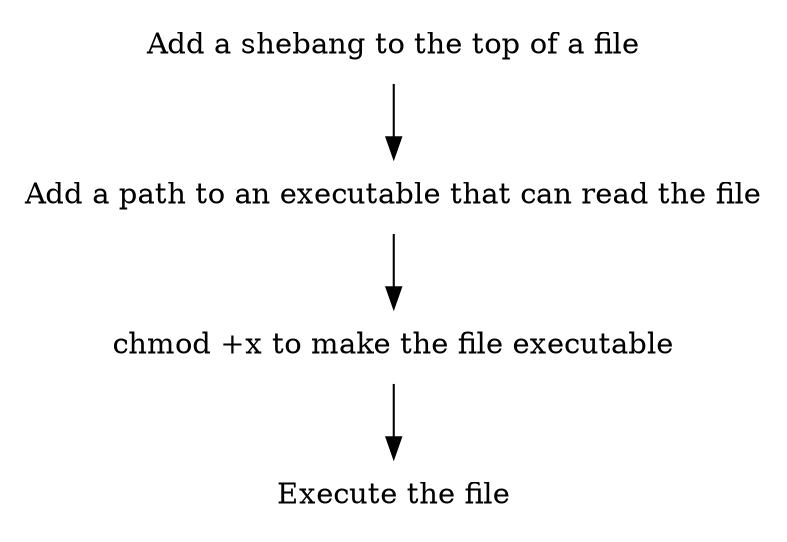

## A quick review of shebangs and interpreters

If you've ran a script with `#!/usr/bin/bash` or similar at the top, you've used a shebang.
The actual shebang is a pair of bytes at the start of a file, specifically `#!` on most Unix systems. It's followed by an absolute path to an executable to be used as an "interpreter". When you execute a file, the kernel looks for the shebang at the start of the file, finds the interpreter, and executes the interpreter with the file passed as an argument. 

So if you put the following code into a file named `hello.sh`, and use `chmod +x hello.sh` to make it executable...

```bash
#!/usr/bin/bash
echo "hello world"
```

The interpreter is `/usr/bin/bash`, and the file it reads is `hello.sh`, meaning that the kernel executes `/usr/bin/cat ./hello.sh` when it's called with `./hello.sh`.

There's a bit of nuance to [how the shebang line gets split up in various systems](https://www.in-ulm.de/~mascheck/various/shebang/) that's beyond the scope of this article, so for most of these examples, I will be using `#!/usr/bin/env -S` in my shebang lines; that allows me to specify *another* program to use as an interpreter and splits the remainder of the line into arguments for it.

Where things get fun is that you can specify ANY program as an interpreter. Most people only use `env`, `bash`, `python`, `perl`, `ruby` or whatever is associated with a known programming language. We're going to get a little unhinged and explore some more cursed uses.

## Executable configuration-as-code

Any language specification where `#` is interpreted as a comment can make use of a shebang line at the top. That includes [YAML](https://yaml.org/spec/), [TOML](https://toml.io/en/), most things compatible with python's [configparser module](https://docs.python.org/3/library/configparser.html) (commonly .ini, .cfg or .conf files), and more. Because these file formats are often just used for configuration, you can use an existing program associated with them as a shebang. A couple of examples:

### docker

This will let you rebuild a docker image just by executing the dockerfile:

```dockerfile
#!/usr/bin/env -S docker build -t some_image /path/to/project/docker/build/context -f
FROM scratch
```
It's pretty easy to write a custom interpreter that will combine the build and run steps, but at that point you might as well install `docker-compose` and use a shebang of `#!/usr/bin/env -S docker-compose -f` in `docker-compose.yaml`. You might think it's kind of redundant since `docker-compose` already uses whatever `docker-compose.yaml` it finds, but sometimes it's handy to have your own personalized version of version-controlled set ups.

### tmux

[The Tao of tmux](https://leanpub.com/the-tao-of-tmux/read#reload-config) suggests using `bind r source-file ~/.tmux.conf` to reload your config, but that's a waste of a keybind in my opinion for something done so infrequently. What I do instead is have `#!/usr/bin/tmux source-file` at the top of `~/.tmux.conf` and call `~/.tmux.conf` from anywhere to reload the configuration.

You don't have to use it to just reload either; tmux has a robut set of commands you can use to spawn an entire tmux window pre-configured to whatever you want. For instance, this one will start some locally-hosted server, monitor the database for some query of interest, monitor the log, and all of them go away with a simple Ctrl+C.

```bash
#!/usr/bin/env -S tmux source-file
new-window docker-compose run server
split-window -h watch -n1 "sqlite3 data.db 'SELECT * FROM users'"
split-window -h tail -F ./server.log
select-layout main-vertical
setw synchronize-panes
```

### dot

Sometimes supporting shebangs is unintentional. For the files that Graphviz's `dot` utility accepts, the [graphviz documentation](https://graphviz.org/doc/info/lang.html) indicates that the shebang is interpreted as output from a C preprocessor and is discarded. So that means we can put whatever interpreter we want in there but it'll still be ignored by `dot`. Here's an example that renders a dot file as a .png file of the same name.



### pandoc

As much as I love markdown syntax, it sparks joy when I can read through my notes with a nice dark theme, syntax highlighting, and all the other goodies HTML and CSS have to offer. Lucky for me, pandoc accepts a "defaults.yaml" file for conversions.

```yaml
#!/usr/bin/env -S pandoc -d
from: markdown
to: html5
standalone: true
toc: true
css: style.css
highlight-style: haddock
```

### Other honorable mentions

- iconv: `#!/usr/bin/env iconv -S -o destination` will let you copy the file with the shebang to its appropriate destination, kinda like `cp` but with the args reversed. Pretty nice to just have a built-in one-word autocomplete instead of having to type two file paths.
- ssh: Your config at ~/.ssh/config can benefit from a shebang, but the spec has enough per-host configuration that you likely don't need multiple versions.
- curl: `#!/usr/bin/env -S curl -K` lets you specify an ini-like syntax to override command line parameters. This extends the functionality from stuff that runs on your system to whatever public APIs are out there on the internet.
- vim: Vim 9.1 and onward can use `#!/usr/bin/env -S vim -S` to start vim with a number of pre-configured options. Pretty useful if you share an account on a system with others and you don't want to torture others with your weird vim settings.

There's likely hundreds more filetypes to be found in your IDE's syntax-highlighting settings. `grep 'comments.*#' /usr/share/vim/*/ftplugin/*.vim` gives me a ton. Let's go a bit farther and make our own formats.

## Object-oriented programming, but every object is a file

Since `#!/usr/bin/env -S` lets us combine whatever series of arguments with a single filename, this allows for a sort of object-oriented programming in the shell, where files are the objects.

Normally, a file without a shebang is just pure data, akin to a struct in C. Whether it's configuration, a log, or even code, it's just data. If we add a shebang however, we inject the potential for function, depending on what its interpreter does.

Basically, imagine the [Type Object pattern](https://gameprogrammingpatterns.com/type-object.html) where the file is the "typed object" and the "type" is the shebang line. Now combine that with the [Command pattern](https://gameprogrammingpatterns.com/command.html) where every one of those files is now a command. We now get those two in basically any language capable of executing files.

### Example 1: pathlib for the shell

To illustrate, here's an example of a interpreter that will expose some of python's pathlib functionality to the shell. [pathlib](https://docs.python.org/3/library/pathlib.html) provides a bunch of utilities for treating file paths as objects and additional operations for manipulating them in python, and I always thought it'd be nice to have that simplicity in the shell. Save the following as `file_as_obj.py`:

```python
#!/usr/bin/env python3
import inspect
import argparse
import pathlib
import sys

def main():
    # Build up a list of attributes of a path object
    attrs = [_ for _ in dir(pathlib.Path)]
    attrs = filter(lambda _: not _.startswith("_"), attrs)
    attrs = filter(lambda _: not callable(getattr(pathlib.Path, _)), attrs)

    # Create our ArgumentParser, taking in that list of attributes
    parser = argparse.ArgumentParser()
    parser.add_argument("filepath", type=pathlib.Path)
    parser.add_argument("attr", choices=list(attrs))
    args, other_args = parser.parse_known_args()

    shebang_file = args.filepath
    attribute = getattr(shebang_file, args.attr)
    print(attribute)


if __name__ == "__main__":
    main()
```

In some other file in the same directory, say `some_other_file.txt`, include just a single shebang line, `#/usr/bin/env -S ./file_as_obj.py`. (You can drop the `./` if `file_as_obj.py` is in your `$PATH`). Run `chmod +x file_as_obj.py some_other_file.txt` to make them both executable. If everything's been done correctly, you can then run `some_other_file.txt` to see the usage message, among other functions:

```
$ ./some_other_file.txt
usage: file_as_obj.py [-h] filepath {anchor,drive,name,parent,parents,parts,root,stem,suffix,suffixes}
file_as_obj.py: error: the following arguments are required: attr
$ ./some_other_file.txt name
some_other_file.txt
$ ./some_other_file.txt stem
some_other_file
$ ./some_other_file.txt suffix
.txt
```

It feels so wrong, yet full of potential, doesn't it? It gets better/worse, depending on how disgusted you are so far.

### Example 2: Ignoring files in git from command-line

Here's another use-case (read: contrived example). Let's say we wanted to add stuff to a `.gitignore` file from command line instead of having to edit it ourselves, with a sort of similar syntax as `git add`. We can write an interpreter named `ignore.py`:

```python
#!/usr/bin/env python3
import argparse
import pathlib

def main():
    parser = argparse.ArgumentParser()
    parser.add_argument("ignore_file", type=pathlib.Path, help="A file to store ignored file paths")
    parser.add_argument("paths", type=pathlib.Path, nargs="+", help="One or more file paths.")
    args = parser.parse_args()

    with open(args.ignore_file, "a") as f:
        for path in args.paths:
            print(str(path), file=f)
            print(f"Ignoring {path}")


if __name__ == "__main__":
    main()
```

All this thing will do is treat the first argument as a file (it's basically gonna be tradition for these custom interpreters) then treat the remaining ones as file paths to append to it.

In `.gitignore` we add `/usr/bin/env -S ./ignore.py` to the top (again, you can drop the `./` if `ignore.py` is in your `$PATH`). After a `chmod +x ./ignore.py .gitignore` to make both files executable, you can now run .gitignore as so:

```
$ cat ./.gitignore
#!/usr/bin/env -S ignore.py
$ ./.gitignore secret_api_key.txt
Ignoring secret_api_key.txt
$ cat ./.gitignore
#!/usr/bin/env -S ignore.py
secret_api_key.txt
```

The neat thing is that `.dockerignore` follows basically the same syntax, so we can use the same shebang, `chmod +x` again, run `.dockerignore ignored_file_1 ignored_file_2` and the files get added to `.dockerignore` instead!
This is just defaulting to a simple append, other operations like removing or listing are up to you to try. 


## Useful practices/patterns


1. The command used in the shebang line doesn't even necessarily have to read the file. If it doesn't, then a shebang file can act as a sharable, version-controllable alias, even with custom auto-completion separate from the interpreter that actually runs it.
2. If your system has the `run-parts` command, you can run multiples of these shebang files in bulk. You wouldn't type `interpreter config0.ini; interpreter config1.ini; interpreter config2.ini...`, you can just call `run-parts` on whatever directory all those configurations are located in.
3. Control your configuration format! A simple enough configuration format will allow you to programmaticlly generate them and be much easier to debug.


## Further Reading

[Self-contained Python scripts with uv - the.dusktreader blog](https://blog.dusktreader.dev/2025/03/29/self-contained-python-scripts-with-uv/)

[🐳 Dockerfile.exe](https://bitplane.net/log/2024/12/dockerfile.exe/)
